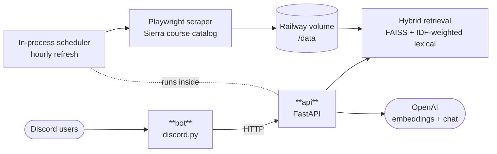

# Sierra Class Helper

An AI academic advisor for Sierra College. Students @-mention a Discord bot with questions like *"what CS classes are open in fall?"* or *"when does MATH 31 meet?"* and get accurate, up-to-date answers pulled from the college's live course catalog.

---

## Architecture



Two services on Railway from one repo: `api` (FastAPI + embedded scheduler) and `bot` (Discord frontend).

---

## What makes it work

- **Hybrid retrieval** — FAISS vector search fused with an IDF-weighted lexical channel. The lexical side keeps its magnitude (not just rank), so distinctive-but-rare title words like *"linear"* can beat what pure embeddings prefer. See [src/embeddings/core.py](src/embeddings/core.py).
- **In-process scheduler** — course data refreshes hourly and professor ratings daily, writing to the same volume the API serves from. Railway volumes can't be shared between services, so a separate cron container's writes would never reach the API. See [src/api/scheduler.py](src/api/scheduler.py).
- **Atomic reload** — the scheduler builds a fresh `SearchIndex` and swaps one module-level reference. In-flight requests keep working against their snapshot; the next request sees the new data. No half-swapped state.
- **Retrieval-first response** — every `/chat` call does one FAISS+lexical retrieval and one LLM call. Language, topic-continuation, and course-vs-identity decisions live in the system prompts rather than as separate classifier round-trips.

---

## Layout

```
src/
├── api/            FastAPI server + in-process refresh scheduler + analytics
├── bot/            Discord bot (thin frontend; every message calls the API)
├── embeddings/     SearchIndex class + hybrid retrieval + incremental/fast rebuild CLIs
├── scraper/        Playwright scraper + RateMyProfessors fetcher
├── jobs/           Refresh jobs run by the scheduler
├── utils/          Formatting, paths, subject mapping, sanitize, RMP lookup
└── config.py       Single source of truth for models, filenames, and env vars
```

> [!NOTE]
> Only `api_server.py` and `discord_bot.py` live at the repo root as thin entry points for Railway's start commands. Everything else is under `src/`.

---

## Quickstart

```bash
# Install
python3 -m venv .venv && source .venv/bin/activate
pip install -r requirements.txt
playwright install chromium

# Configure
cp .env.example .env
# Edit .env: set OPENAI_API_KEY and DISCORD_BOT_TOKEN

# Cold-start data build (only needed once)
python -m src.scraper.cli               # scrape currently-active terms
python -m src.scraper.ratemyprofessors  # fetch professor ratings
python -m src.embeddings.incremental    # build the FAISS index

# Run both services
./start_local.sh                        # api on :8000, bot connects to it
```

Refresh data during development (skips re-embedding unchanged courses):

```bash
python -m src.scraper.cli
python -m src.embeddings.fast
```

---

## Environment variables

Read via `Config`, not `os.environ`. Set in `.env` locally, in the Railway dashboard in production.

| Variable | Service | Required | Purpose |
|---|:---:|:---:|---|
| `OPENAI_API_KEY` | api | ✓ | Embeddings + chat completions |
| `DISCORD_BOT_TOKEN` | bot | ✓ | Bot login |
| `API_URL` | bot | ✓ in prod | Where the bot POSTs `/chat`. On Railway, wired to the api's private domain. |
| `SIERRA_DATA_DIR` | api | ✓ in prod | `/data` on Railway (mounted volume); defaults to `.` locally |
| `SIERRA_ENABLE_SCHEDULER` | api | ✓ in prod | Set to `1` to run the hourly refresh loop |
| `SIERRA_ADMIN_TOKEN` | api | optional | Gates `GET /admin/stats` |
| `SIERRA_BOT_CHANNEL_IDS` | bot | optional | Comma-separated Discord channel IDs the bot responds in |

---

## Testing

```bash
pytest                             # all unit tests, sub-second
pytest -m integration              # needs OPENAI_API_KEY + built FAISS index
pytest tests/test_search_hybrid.py # single file
```

> [!TIP]
> Tests focus on regression cases. Every failing search behavior that's been caught has a test named after it — e.g. `test_year_does_not_prefix_match_course_number`, `test_linear_algebra_beats_college_algebra`. If you fix a search bug, add the test that would have caught it.

---

## Deployment

Two Railway services from the same repo:

| Service | Build | Notes |
|---|---|---|
| **api** | Dockerfile ([`Dockerfile.api`](Dockerfile.api)) using `mcr.microsoft.com/playwright/python` as the base image | Chromium + system libs pre-installed. Volume mounted at `/data`. |
| **bot** | Railpack (auto-detected from `requirements.txt`) | No Dockerfile needed. Runs `python discord_bot.py`. |

See [DEPLOYMENT.md](DEPLOYMENT.md) for the step-by-step setup, environment variables, and cold-start behavior.

---

## Discord commands

| Trigger | What it does |
|---|---|
| Mention the bot in an allowed channel | Ask a natural-language question about courses |
| `/ask <question>` | Same, as a slash command |
| `/search <query>` | Raw search results without LLM formatting |
| `/clear` | Reset your 30-minute conversation context |
